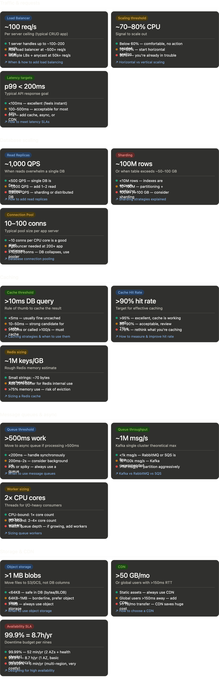

# System Design Thresholds Cheat Sheet

## 1. Traffic & Requests

### Load Balancer (`~100 req/s`)
* **Description:** A single application server typically handles up to 100–200 requests per second (RPS) for standard CRUD logic.
* **Tipping Point:** Introduce a single Load Balancer (LB) when traffic reaches **500+ req/s**. Scale to multiple LBs using Anycast routing when traffic hits **50k+ req/s**.

### Scaling Threshold (`~70–80% CPU`)
* **Description:** CPU utilization is the main signal for scaling out app instances.
* **Tipping Point:** Below 60% is comfortable. Trigger horizontal auto-scaling (spinning up more containers) when CPU reaches **70–80%**. Hitting 90%+ means the instance is bottlenecking.

### Latency Targets (`p99 < 200ms`)
* **Description:** The ultimate goal for user-facing API response times.
* **Tipping Point:** Under 100ms is excellent. If your p99 latency creeps into the **100–500ms** range, it is acceptable but needs review. If it crosses **500ms+**, you must aggressively add caching or optimize database queries.

---

## 2. Database Scaling

### Read Replicas (`~1,000 QPS`)
* **Description:** The threshold where a single database instance gets overwhelmed by read requests.
* **Tipping Point:** Under 500 QPS is safe for a single node. When you cross **1,000+ Read QPS**, split traffic by adding 1 or 2 Read Replicas. If reads scale exponentially beyond that, look toward a distributed DB.

### Sharding (`~100M rows`)
* **Description:** Scaling data storage and write capacity horizontally across multiple database nodes.
* **Tipping Point:** Databases handle under 10M rows easily because indexes fit in RAM. When a single table crosses **100M rows (or 50–100 GB)**, implement database partitioning or sharding.

### Connection Pool (`10–100 conns`)
* **Description:** The number of persistent database connections maintained *per application instance*.
* **Tipping Point:** Standard setups run smoothly at ~10 connections per CPU core. Introduce connection poolers (like PgBouncer for Postgres) if you have hundreds of application instances, as allowing **5,000+ concurrent connections** will collapse DB performance.

---

## 3. Caching

### Cache Threshold (`>10ms DB query`)
* **Description:** The performance indicator that tells you a query is too expensive to run directly against the database every time.
* **Tipping Point:** Queries taking under 5ms don't need caching. If a query takes **10–50ms**, it is a strong candidate. If it takes **>100ms** or is executed more than 100 times per second, caching via Redis/Memcached is **mandatory**.

### Cache Hit Rate (`>90% hit rate`)
* **Description:** The percentage of incoming read requests successfully served by the cache instead of falling through to the database.
* **Tipping Point:** Aim for **>90%** for an efficient cache layer. An 80–90% rate is acceptable but needs review. If it drops **below 70%**, your caching strategy is failing (wrong keys, or data is evicting too quickly).

### Redis Sizing (`~1M keys/GB`)
* **Description:** A quick rule of thumb for estimating how much RAM your Redis cluster needs.
* **Tipping Point:** Small, basic strings take about 70 bytes each, meaning you can fit roughly 1 Million keys per Gigabyte of RAM. Keep total Redis memory utilization **below 75%** to avoid unexpected data eviction.

---

## 4. Message Queues & Async

### Queue Threshold (`>500ms work`)
* **Description:** When to pull heavy processing tasks out of the synchronous request-response flow.
* **Tipping Point:** Tasks taking under 200ms can run synchronously. If a process takes **200ms–2s** (like sending an email or third-party API calls), move it to a background worker. For heavy operations (video encoding, report generation), always use a message queue.

### Queue Throughput (`~1M msg/s`)
* **Description:** Choosing the right message broker technology based on the volume of data traffic.
* **Tipping Point:** For traffic **under 10k messages/sec**, traditional brokers like RabbitMQ or AWS SQS are perfect. If your ingestion scales to **100k to 1M+ messages/sec**, switch to log-based streaming platforms like **Kafka**.

### Worker Sizing (`2x CPU cores`)
* **Description:** Sizing the execution threads on background worker instances.
* **Tipping Point:** For CPU-bound tasks, allocate 1 thread per core. For I/O-heavy background tasks (waiting on disks or network APIs), configure **2x to 4x threads per CPU core**. If the queue depth keeps growing, add more physical worker nodes.

---

## 5. Storage & CDN

### Object Storage (`>1 MB blobs`)
* **Description:** Deciding whether a file belongs in a database table or external cloud storage.
* **Tipping Point:** Small binary data under 64 KB is safe to store directly in SQL/NoSQL. Anything **between 64 KB and 1 MB** is borderline, but anything **>1 MB** (photos, PDFs, videos) must be stored in Object Storage (like AWS S3), saving only the URL string in the database.

### CDN (`>50 GB/mo`)
* **Description:** Offloading static asset delivery to global edge servers to save application bandwidth and minimize user latency.
* **Tipping Point:** Always use a Content Delivery Network (CDN) for static assets. Mandate it if you have global users sitting **>150ms away** from your primary data center, or if your data transfer volume crosses **50 GB to 1 TB+ per month**.

### Availability SLA (`99.9% = 8.7h/yr`)
* **Description:** Calculating your allowed system downtime budget based on your Service Level Agreement (SLA).
* **Tipping Point:**
    * **99.9% ("Three Nines"):** Allows up to **8.7 hours** of downtime per year. This is the baseline goal for standard applications.
    * **99.99% ("Four Nines"):** Allows only **52 minutes** of downtime per year, requiring automated failovers.
    * **99.999% ("Five Nines"):** Allows just **5.2 minutes** of downtime per year, requiring complex, multi-region active-active infrastructures.